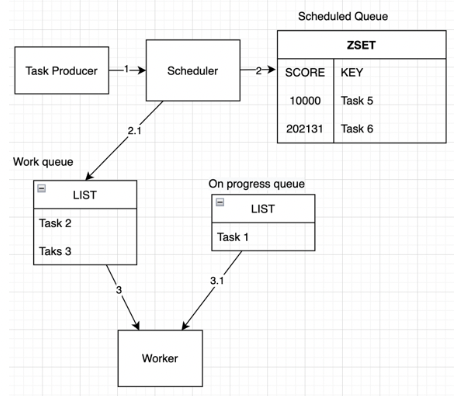

# goscheds
[](https://codecov.io/gh/luqmansen/go-caskdb)
[](https://github.com/luqmansen/go-caskdb/actions/workflows/test.yml)

Job Scheduler library for Go

## Supported data store 

- Redis
- Will support many more, stay tuned!

## Example

### Basic usage
```go
package main

import (
	"context"
	"fmt"
	"time"
	"github.com/go-redis/redis/v9"
	"github.com/luqmansen/goscheds"
)

func initRedis() *redis.Client {
    return redis.NewClient(
		&redis.Options{
			Addr:     "localhost:6379",
			Password: "",
			DB:       1,
		})
}

func main() {
	
	const job_name = "your_job_name"
	ctx := context.Background()

	// worker and scheduler SHOULD use different redis connection
	// because some worker operation will be blocking
	scheduler := goscheds.NewRedisScheduler("namespace", initRedis())

	// this will start the scheduler
	// it will be blocking, should run on goroutine
	go scheduler.StartScheduler(ctx)

	job := &goscheds.ScheduledJob{
		JobName: job_name,
		Id:      "1234",
		ExecuteAt: time.Now().Add(24 * time.Hour), 
		Args: map[string]interface{}{
			"args": "can be anything",
		},
	}

	// will be executed as time in job.ExecuteAt
	scheduler.PushScheduled(ctx, job)
	
	// job.ExecuteAt will be ignored, will be executed by worker immediately
	scheduler.Push(ctx, job) 

	// job name here should be equal with your registered handler
	worker := goscheds.NewRedisWorker(job_name, initRedis())
	
	// function handler should satisfy goscheds.HandlerFunc
	worker.RegisterHandler(job_name, func(job *goscheds.ScheduledJob) error {
		fmt.Println(job.Id, " executed")
		return nil
	})

	worker.ProcessJob(ctx)
}

```

## How It Works
### Redis

#### The Idea
1. Task producer will push a scheduler, pushed data contains the task payload
   and the execution time
2. Scheduler saves data to ZSET, it will convert the execution time to ZSET score.
   We will have one ZSET data to store the entire scheduled task, and we will have as many LIST as we need for every one of the tasks that we registered.
   Scheduler will have to mechanism to check a task:
   
   - Everytime there is a task from producer, it will check whether that task execution time is greater or equal to the current time, if not push it to ZSET

   - Scheduler will get the top most item from ZSET and check if that task 
   scheduled execution time is less or equal to the current time, if it is, then push that to the work queue, else (if the top most item is greater than current time, it will sleep and block the execution until the time has come. Ideally, this is performed on the background (eg: using goroutine in Go)
3. The Worker will perform atomic operation pop data from the work queue using BLPOP and push it using RPUSH to on progress queue. This will make sure that data can be recovered in the event of a worker having hard failure (more detail below). Once the worker obtains a task to be worked on, it will delegate the task to a registered handler.
   Worker and Task Producer should use different redis client instances, because of the blocking behavior of this BLPOP command.

#### Handling Failure
There are two kind of possible failure that can happen
1. Failure to execute the task
   This failure is caused by some error when executing function. In the event of failure, the task will still exist on the queue. It will be retried by other worker immediately (depending on the available worker)
2. Hard failure (eg: Server Crash)
   In this case, the task will still exist in the on progress queue. There will be a dedicated background process to clean up and re-queue the task to the worker queue if the task time has already exceeded the timeout value.


## Todo
- Add benchmark
- Add other data store